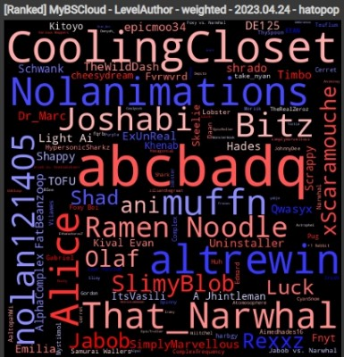
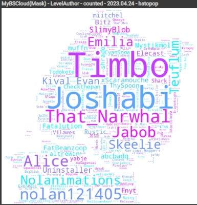
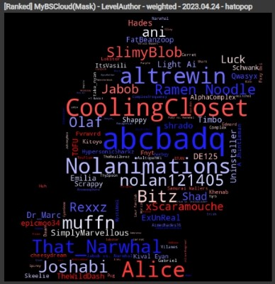

## MyBSCloud

->[Google Colab](https://colab.research.google.com/github/hatopopvr/MyBSCloud/blob/main/MyBSCloud.ipynb)

<b>概要</b>  

ScoreSaberのデータを使用して自分のBeatSaberのプレイを構成するmapperやartistのwordcloud画像を作成するツールです。 
ワードの出現数ベース(背景白)とPPWeightベース(背景黒)の2種類のWordCloudを出力します。 
マスク画像を使用することで自分らしいwordcloud画像を作成することもできます。 
Google Driveの認証はScoreSaberのプレイデータを保存することのみに使います。(ScoreSaber APIへのアクセス負荷減のため) 
作成するwordcloudは日本語には対応していません。 

- 例) Mapperのword cloud…背景白:ワードの出現数ベース(アンランクのみ), 背景黒:PPWeightベース

 

- 例) Mapperのword cloud(Mask)…背景白:ワードの出現数ベース, 背景黒:PPWeightベース

 

<b>データ元</b>
- ScoreSaber Public API - [doc](https://docs.scoresaber.com/)  

<b>このノートの作者</b>
- hatopop ([@hatopop_vr](https://twitter.com/hatopop_vr))

<b>Libraries</b>

このノートブックでは以下のサードパーティ製のライブラリを使用しています。

- [**pandas**](https://pandas.pydata.org/): データの操作と分析のためのライブラリ。
- [**numpy**](https://numpy.org/): 数値計算のためのライブラリ。
- [**matplotlib**](https://matplotlib.org/) & [**seaborn**](https://seaborn.pydata.org/): データの可視化のためのライブラリ。
- [**tqdm**](https://tqdm.github.io/): 進捗バーを表示するためのライブラリ。
- [**PIL (Pillow)**](https://pillow.readthedocs.io/en/stable/): 画像処理のためのライブラリ。
- [**wordcloud**](https://amueller.github.io/word_cloud/): ワードクラウドの生成のためのライブラリ。
- [**openai**](https://github.com/openai/openai): OpenAI APIを利用するためのライブラリ。
