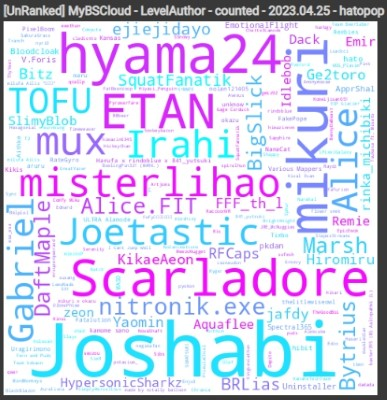
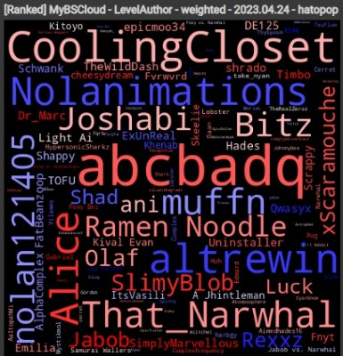
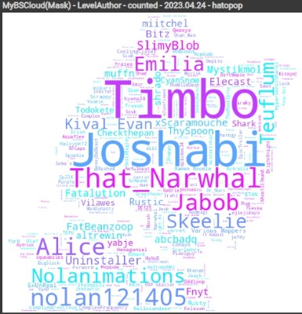
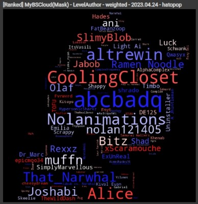

## MyBSCloud

<b>[README(日本語)](README.md)</b>

->[Google Colab](https://colab.research.google.com/github/hatopopvr/MyBSCloud/blob/main/MyBSCloud.ipynb)

<b>Overview</b>

This tool creates word cloud images of the mappers and artists that make up your Beat Saber plays using ScoreSaber data. It outputs two types of WordClouds: based on word frequency (white background) and PPWeight (black background). You can also create a personalized word cloud image using a mask image. Google Drive authentication is only used to save your ScoreSaber play data (to reduce access load on the ScoreSaber API).

- Example) Mapper's word cloud… White background: based on word frequency (unranked only, etc.), Black background: PPWeight-based

 

- Example) Mapper's word cloud(Mask)… White background: based on word frequency, Black background: PPWeight-based

 

<b>Data Source</b>

- ScoreSaber Public API - [doc](https://docs.scoresaber.com/)

<b>Author of this notebook</b>

- hatopop ([@hatopop\_vr](https://twitter.com/hatopop_vr))

<b>Libraries</b>

This notebook uses the following third-party libraries:

- [**pandas**](https://pandas.pydata.org/): A library for data manipulation and analysis.
- [**numpy**](https://numpy.org/): A library for numerical computations.
- [**matplotlib**](https://matplotlib.org/) & [**seaborn**](https://seaborn.pydata.org/): Libraries for data visualization.
- [**tqdm**](https://tqdm.github.io/): A library to display progress bars.
- [**PIL (Pillow)**](https://pillow.readthedocs.io/en/stable/): A library for image processing.
- [**wordcloud**](https://amueller.github.io/word_cloud/): A library for generating word clouds.
- [**openai**](https://github.com/openai/openai): A library for using the OpenAI API.
